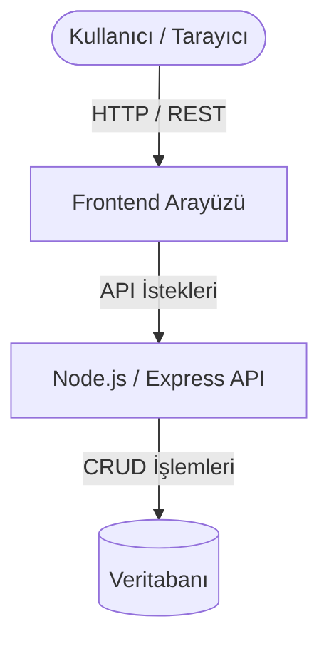
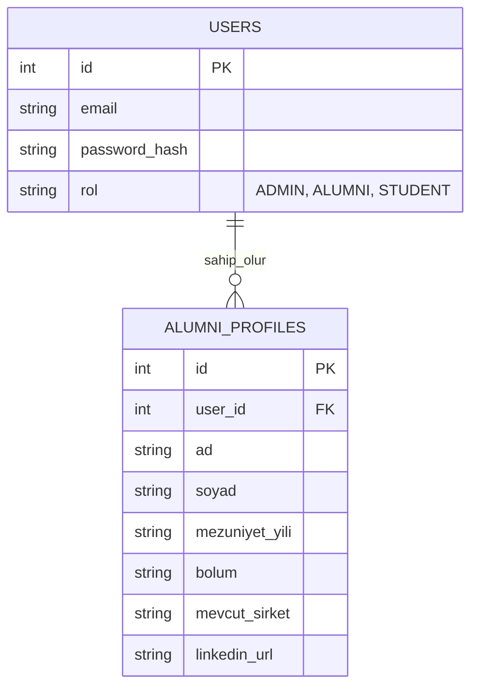

# 🎓 Alumni Tracking System (Mezun Takip Sistemi)

## 📖 Proje Hakkında

Bu proje, **Web Programlama** dersi kapsamında geliştirilen, üniversite mezunları ile mevcut öğrencileri bir araya getiren kapsamlı bir **Mezun Takip Sistemi** platformudur. 

Temel amacımız; mezunların kariyer yolculuklarını takip etmek, öğrenciler için mentörlük fırsatları yaratmak ve kurumsal iletişim ağını güçlü, sürdürülebilir bir sistem (RESTful API destekli) üzerinde inşa etmektir. Modüler bir yapıda tasarlanmış olup geliştirilmeye açıktır.

---

## 🚀 Öne Çıkan Özellikler

* **👤 Profil ve Kariyer Takibi:** Mezunların çalıştığı şirketler, departmanlar, yetkinlikleri ve iletişim bilgileri.
* **🔍 Gelişmiş Filtreleme:** Mezuniyet yılına, bölüme veya mevcut sektöre göre detaylı arama sistemi.
* **🤝 Mentörlük Ağı:** Mevcut öğrenciler ile tecrübeli mezunlar arasında iletişim ve buluşma altyapısı.
* **💼 İş & Staj İlanları:** Sadece platform üyelerine özel kariyer fırsatlarının paylaşıldığı ilan panosu.
* **📊 Yönetim Paneli:** Sistem istatistiklerinin (istihdam oranları vb.) görüntülendiği admin arayüzü.

---

## 🛠️ Kullanılan Teknolojiler

*(Projenin ilerleyen aşamalarına göre güncellenecektir)*

* **Backend & API:** Node.js, Express.js
* **Veritabanı:** PostgreSQL / MySQL *(Başlangıç aşamasında In-Memory / JSON kullanılabilir)*
* **Frontend:** React / Next.js, HTML5, CSS3
* **Dokümantasyon & Test:** Swagger UI (OpenAPI 3.0)

---

## 🏛️ Sistem Mimarisi



---

## ⚙️ Kurulum ve Çalıştırma

Projeyi yerel ortamınızda (localhost) çalıştırmak için aşağıdaki adımları izleyin:

### 1. Repoyu Klonlayın
```bash
git clone https://github.com/ADNARAGORN/alumni.git
cd alumni
```

### 2. Bağımlılıkları Yükleyin
Proje klasöründe terminali açıp gerekli paketleri kurun:
```bash
# Backend paketlerini kurmak için (Node.js kullanılıyorsa)
npm install
```

### 3. Ortam Değişkenlerini (ENV) Ayarlayın
Örnek yapılandırma dosyasını kopyalayın ve veritabanı bilgilerinizi girin:
```bash
cp .env.example .env
```

### 4. Sunucuyu Başlatın
```bash
npm start
# veya geliştirme ortamı için: npm run dev
```
Sunucu varsayılan olarak `http://localhost:3000` adresinde çalışacaktır.

---

## 📚 API Dokümantasyonu (Swagger UI)

Projede yer alan tüm RESTful API servisleri **Swagger UI (OpenAPI)** standartlarına uygun olarak dokümante edilmiştir. Swagger arayüzü sayesinde, kodlara bakmanıza gerek kalmadan tüm endpoint'leri tarayıcınız üzerinden görsel olarak inceleyebilir ve interaktif şekilde test edebilirsiniz.

Projeyi çalıştırdıktan sonra tarayıcınızdan aşağıdaki adrese giderek dokümantasyona ulaşabilirsiniz:
👉 **`http://localhost:3000/api/swagger`**

---

## 🔌 Temel API Endpointleri

Geliştirilmekte olan sisteme ait temel RESTful servisler aşağıdaki tabloda listelenmiştir:

| HTTP Metodu | Endpoint | Açıklama | Başarılı Durum |
| :--- | :--- | :--- | :--- |
| **`GET`** | `/api/health` | Sunucu sağlık ve veritabanı bağlantı kontrolü | `200 OK` |
| **`GET`** | `/api/users` | Sistemdeki tüm kullanıcıları listeler | `200 OK` |
| **`POST`** | `/api/users` | Yeni bir kullanıcı / mezun kaydeder | `201 Created` |
| **`GET`** | `/api/users/:id` | ID'si verilen kullanıcının detaylarını getirir | `200 OK` |
| **`PUT`** | `/api/users/:id` | Kullanıcı bilgilerini tamamen günceller | `200 OK` |
| **`PATCH`**| `/api/users/:id` | Kullanıcı bilgilerini kısmi olarak günceller | `200 OK` |
| **`DELETE`**| `/api/users/:id` | İlgili kullanıcıyı sistemden siler | `204 No Content` / `200 OK` |

---

## 🗄️ Veritabanı Şeması Taslağı



---

*Bu proje Web Programlama dersi kapsamında geliştirilmektedir.*