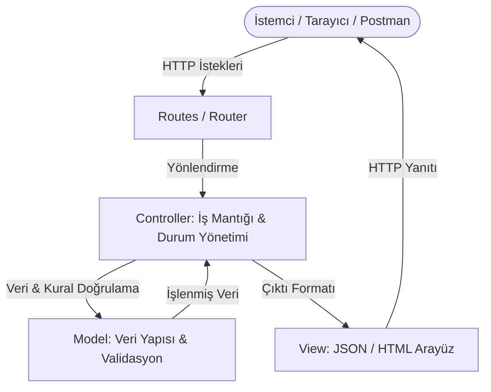
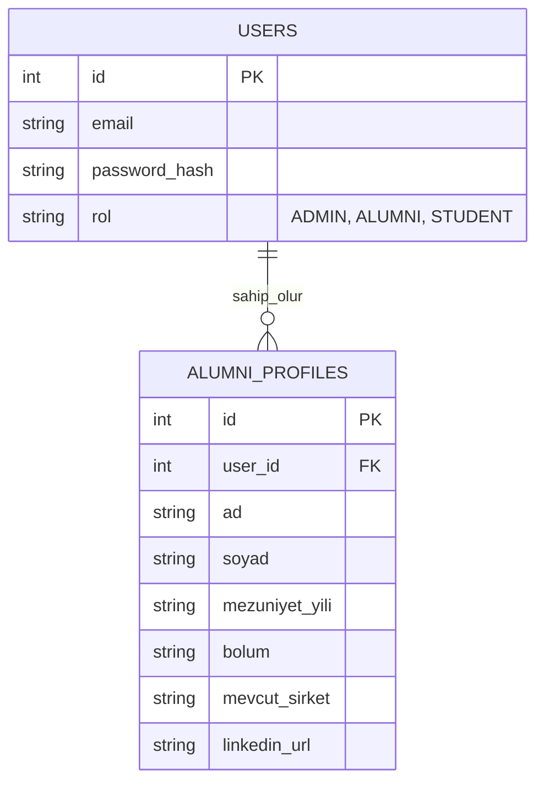

# 🎓 Alumni Tracking System (Mezun Takip Sistemi)

## 📖 Proje Hakkında

Bu proje, **Web Programlama** dersi kapsamında geliştirilen, üniversite mezunları ile mevcut öğrencileri bir araya getiren kapsamlı bir **Mezun Takip Sistemi** platformudur. 

Temel amacımız; mezunların kariyer yolculuklarını takip etmek, öğrenciler için mentörlük fırsatları yaratmak ve kurumsal iletişim ağını güçlü, sürdürülebilir bir sistem (RESTful API destekli) üzerinde inşa etmektir. Modüler bir yapıda tasarlanmış olup geliştirilmeye açıktır.

---

## 🚀 Öne Çıkan Özellikler

* **👤 Profil ve Kariyer Takibi:** Mezunların çalıştığı şirketler, departmanlar, yetkinlikleri ve iletişim bilgileri.
* **🔍 Gelişmiş Filtreleme:** Mezuniyet yılına, bölüme veya mevcut sektöre göre detaylı arama sistemi.
* **🤝 Mentörlük Ağı:** Mevcut öğrenciler ile tecrübeli mezunlar arasında iletişim ve buluşma altyapısı.
* **💼 İş & Staj İlanları:** Sadece platform üyelerine özel kariyer fırsatlarının paylaşıldığı ilan panosu.
* **📊 Yönetim Paneli:** Sistem istatistiklerinin (istihdam oranları vb.) görüntülendiği admin arayüzü.

---

## 🛠️ Kullanılan Teknolojiler

*(Projenin ilerleyen aşamalarına göre güncellenecektir)*

* **Backend & API:** Node.js, Express.js
* **Veritabanı:** PostgreSQL / MySQL *(Başlangıç aşamasında In-Memory / JSON kullanılabilir)*
* **Frontend:** React / Next.js, HTML5, CSS3
* **Dokümantasyon & Test:** Swagger UI (OpenAPI 3.0)

---

## 🏛️ Mimari Yapı: Model-View-Controller (MVC)

Bu proje, kodun sürdürülebilirliğini, okunabilirliğini ve sorumlulukların ayrıştırılmasını (Separation of Concerns) sağlamak amacıyla **MVC (Model-View-Controller)** mimari deseni temel alınarak tasarlanmıştır.

### 📐 MVC Bileşenleri ve Sorumluluk Dağılımı



#### 1. 🛣️ Routes (Yönlendirme Katmanı - Table of Contents)
* **Görevi:** Gelen HTTP isteklerini (`GET`, `POST`, `PUT`, `PATCH`, `DELETE`) karşılar ve ilgili Controller fonksiyonuna yönlendirir.
* **Kural:** Rotalar içinde doğrudan iş mantığı, veri manipülasyonu veya kural kontrolleri barındırılmaz; rota bir "içindekiler tablosu" gibi yalnızca adresleme yapar.

#### 2. 🧠 Controller (Yönetici & Akış Katmanı)
* **Görevi:** İstemciden gelen isteği (`req`) okur, parametreleri ayrıştırır, Model ile iletişim kurar ve istemciye uygun HTTP durum kodu (`200`, `201`, `400`, `404`) ile yanıtı (`res`) döner.
* **Kural:** Verinin nasıl saklandığını veya fiziksel yapısını bilmez; iş akışını yönetir ve Model'den dönen sonuca göre yanıtı şekillendirir.

#### 3. 📦 Model (Veri & Kurallar - Data & Validation)
* **Görevi:** Veri yapısını, veri kaynağını (bellek içi liste veya ilişkisel veritabanı) ve iş kurallarını (`Rules & Validation`) tek bir merkezde barındırır.
* **Kural (One Rule, One Place):** İş ve doğrulama kuralları (örneğin: *"Her kullanıcının e-posta adresi zorunludur"*) rotalarda veya controller içinde tekrarlanmaz; doğrudan Model katmanında tek bir yerde tanımlanır. Veritabanına geçildiğinde controller veya view değişmeden sadece Model güncellenir.

#### 4. 👁️ View (Görünüm & Çıktı Katmanı - Two Faces)
* **Görevi:** İstemciye sunulacak çıktıyı biçimlendirir.
* **Kural:** Sistem aynı veri için iki farklı yüz sunabilir:
  * **Programlar / API İstemcileri için:** JSON çıktısı (`res.json()`),
  * **Son kullanıcılar için:** HTML sayfaları / Tablo arayüzü (`res.sendFile()` veya şablon motorları).

### ⚖️ Architectural Comparison: `ApiUserController` vs `UserController`

| Feature | `ApiUserController` (API / Machine Interface) | `UserController` (Web / Human Interface) |
| :--- | :--- | :--- |
| **Target Audience** | **Machines & Clients** (Postman, mobile apps, SPA frontend) | **End Users & Humans** (Standard web browser navigation) |
| **Response Format** | Raw **JSON** (`res.status().json(...)`) | Rendered **HTML** UI & Tables (`res.send(html)`) |
| **Visual Styling** | None (pure key-value data structures) | Responsive layouts, CSS styling, cards, and tables |
| **HTTP Status Codes** | Strict REST semantics (`200 OK`, `201 Created`, `400 Bad Request`, `404 Not Found`) | Primarily `200 OK` for rendered views, redirects for actions |
| **Error Handling** | JSON error payloads (`{ "error": "email required" }`) | Human-readable HTML alerts, error pages, or view banners |
| **Route Prefix** | `/api/users` | `/users` |

---

## ⚙️ Kurulum ve Çalıştırma

Projeyi yerel ortamınızda (localhost) çalıştırmak için aşağıdaki adımları izleyin:

### 1. Repoyu Klonlayın
```bash
git clone https://github.com/ADNARAGORN/alumni.git
cd alumni
```

### 2. Bağımlılıkları Yükleyin
Proje klasöründe terminali açıp gerekli paketleri kurun:
```bash
# Backend paketlerini kurmak için (Node.js kullanılıyorsa)
npm install
```

### 3. Ortam Değişkenlerini (ENV) Ayarlayın
Örnek yapılandırma dosyasını kopyalayın ve veritabanı bilgilerinizi girin:
```bash
cp .env.example .env
```

### 4. Sunucuyu Başlatın
```bash
npm start
# veya geliştirme ortamı için: npm run dev
```
Sunucu varsayılan olarak `http://localhost:3000` adresinde çalışacaktır.

---

## 📚 API Dokümantasyonu (Swagger UI)

Projede yer alan tüm RESTful API servisleri **Swagger UI (OpenAPI)** standartlarına uygun olarak dokümante edilmiştir. Swagger arayüzü sayesinde, kodlara bakmanıza gerek kalmadan tüm endpoint'leri tarayıcınız üzerinden görsel olarak inceleyebilir ve interaktif şekilde test edebilirsiniz.

Projeyi çalıştırdıktan sonra tarayıcınızdan aşağıdaki adrese giderek dokümantasyona ulaşabilirsiniz:
👉 **`http://localhost:3000/api/swagger`**

---

## 🔌 Temel API Endpointleri

Geliştirilmekte olan sisteme ait temel RESTful servisler aşağıdaki tabloda listelenmiştir:

| HTTP Metodu | Endpoint | Açıklama | Başarılı Durum |
| :--- | :--- | :--- | :--- |
| **`GET`** | `/api/health` | Sunucu sağlık ve veritabanı bağlantı kontrolü | `200 OK` |
| **`GET`** | `/api/users` | Sistemdeki tüm kullanıcıları listeler | `200 OK` |
| **`POST`** | `/api/users` | Yeni bir kullanıcı / mezun kaydeder | `201 Created` |
| **`GET`** | `/api/users/:id` | ID'si verilen kullanıcının detaylarını getirir | `200 OK` |
| **`PUT`** | `/api/users/:id` | Kullanıcı bilgilerini tamamen günceller | `200 OK` |
| **`PATCH`**| `/api/users/:id` | Kullanıcı bilgilerini kısmi olarak günceller | `200 OK` |
| **`DELETE`**| `/api/users/:id` | İlgili kullanıcıyı sistemden siler | `204 No Content` / `200 OK` |

---

## 🗄️ Veritabanı Şeması Taslağı



---

*Bu proje Web Programlama dersi kapsamında geliştirilmektedir.*